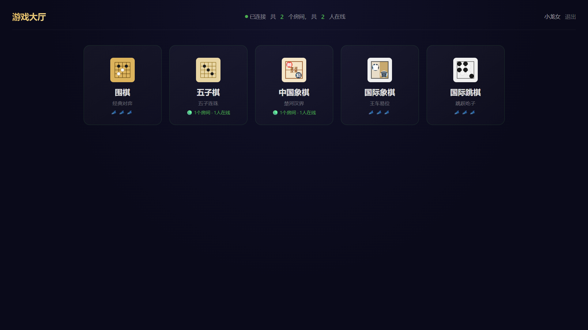
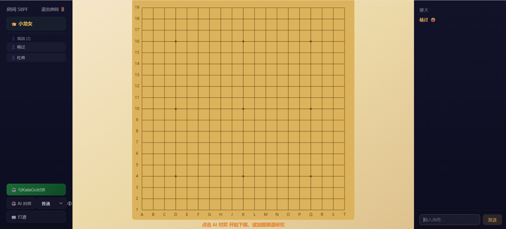
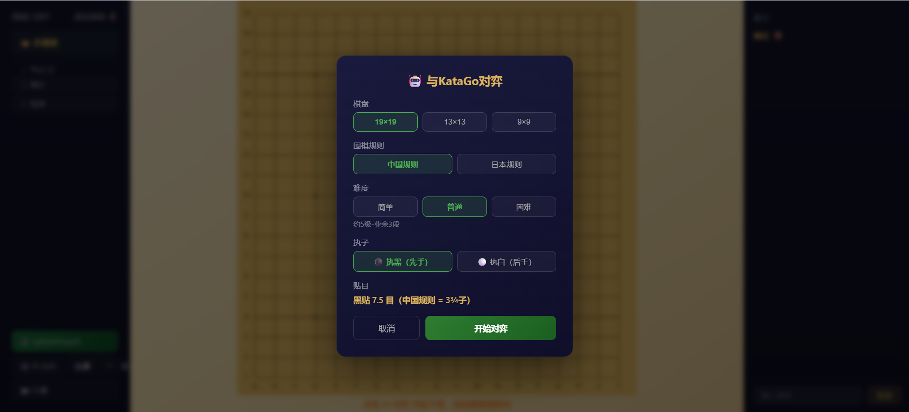
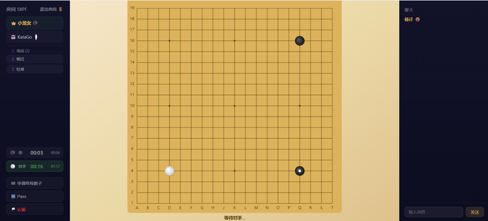
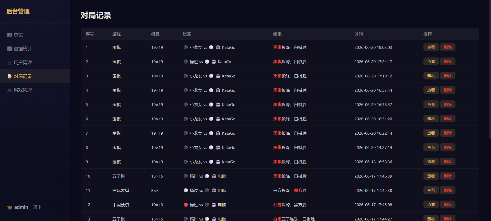

# lan-boardgame

局域网联机对战棋类平台。支持围棋（扩展与Katago对弈）、五子棋、中国象棋、国际象棋、国际跳棋。

## 快速开始

```bash
# 安装依赖
npm install

# 启动服务端
npm run server

# 启动客户端（另一个终端）
npm run client
```

浏览器打开 `http://localhost:3030`


## 对战界面以及后台管理







## 文档

[项目设计文档](docs/项目设计.md)
